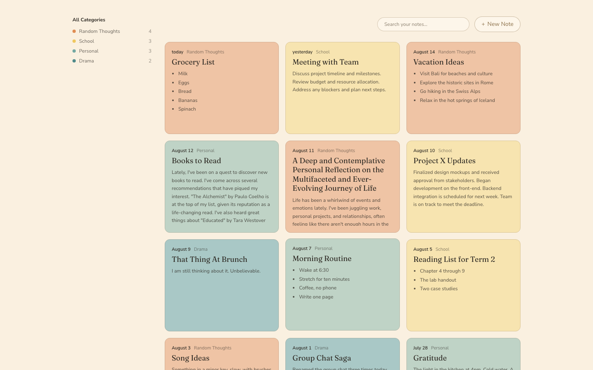
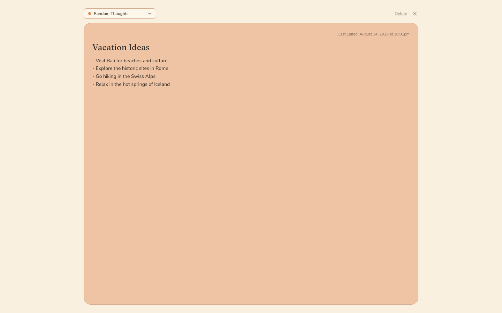
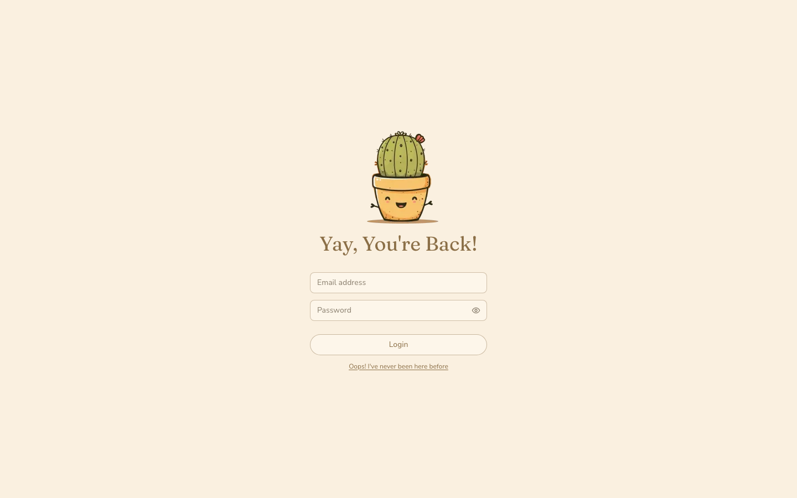

# Turbo Notes

[](https://github.com/kinglee18/turbo-notes/actions/workflows/ci.yml)
[](https://codecov.io/gh/kinglee18/turbo-notes?flags[0]=backend)
[](https://codecov.io/gh/kinglee18/turbo-notes?flags[0]=frontend)

A notes-taking app built for the Turbo AI Senior Full Stack Engineer challenge:
**Django REST Framework** on the back, **Next.js** on the front, built to the provided Figma design.



<p align="center">
  
  
</p>

---

## Running it

You need **Node 20+** and [**uv**](https://docs.astral.sh/uv/) (`brew install uv`). uv fetches its own
Python, so no system Python setup is required. There is no database to install — it is SQLite by default.

```bash
make install && make migrate && make demo-data
```

```bash
make dev
```

Then open **http://localhost:3000** and sign in with the seeded account:

| Email | Password |
| --- | --- |
| `demo@turbo.notes` | `cozy-notes-2024` |

The demo account comes with twelve notes spread across the four categories and a few weeks, so the app
looks like the design immediately rather than showing an empty state. `make help` lists everything else;
the API docs are at http://localhost:8000/api/docs/.

## What it does

- **Email/password auth** — sign up, log in, log out, with rotating refresh tokens.
- **Notes CRUD** with per-user isolation.
- **Four categories** whose colour drives the card, the editor and the sidebar dot.
- **Autosave** — there is no save button anywhere, matching the design.
- **Category filter and live counts** in the sidebar.
- **Search** across titles and bodies.
- **Delete with undo.**

Three of those — delete, logout and search — are not in the Figma. See
[Going beyond the design](#going-beyond-the-design).

---

## Design and technical decisions

### Autosave, because the design has no save button

Every editor frame in the Figma shows a category pill, a close button, and a "Last Edited" timestamp.
Nowhere is there a save control. That is a product decision, and it makes the save path the most
interesting part of the app. [`useAutosave`](frontend/src/hooks/useAutosave.ts) is where it lives:

- **750ms debounce with a 5s max wait**, so someone typing continuously still gets a save every five
  seconds rather than nothing until they pause.
- **Immediate flush** on blur, on category change, on close, and on `visibilitychange`/`pagehide` using
  `fetch(..., { keepalive: true })` so an edit doesn't die with the tab.
- **Single-flight with a trailing queue.** Only one request is ever open for a note. Edits arriving
  mid-request set a dirty flag and go out in *one* follow-up when it lands. This makes out-of-order
  application structurally impossible rather than merely unlikely, which is what lets the server do
  plain last-write-wins.
- **Nothing is sent when nothing changed** — the client diffs against the last known server state, and
  [the server checks again](backend/notes/views.py) before writing, so a no-op PATCH can't bump
  `updated_at`.
- **"Last Edited" renders the timestamp from the response**, never a local clock reading, so what you
  see is by construction what is in the database.

Since the design removed the save button, I added a small **save status** next to the timestamp
(`Saving…` / `Saved` / `Couldn't save — retrying`) in an `aria-live` region. Silent saving is fine
until it fails; then the user needs to know before they close the tab.

`+ New Note` **POSTs immediately** and routes to `/notes/<id>`, rather than holding an unsaved note
client-side. That gives the editor one code path (always PATCH, never "POST if new"), a URL that
survives a refresh, and a truthful timestamp from the first paint. The cost is abandoned blank notes,
so closing a note you never touched deletes it again. The alternative — a client-generated UUID with an
idempotent `PUT` upsert — is tidier in theory but needs a non-standard endpoint and server trust in
client-supplied ids.

### Auth: JWTs in httpOnly cookies, with Next.js as a thin BFF

```
Browser ──(same-origin, cookies)──> Next.js ──(Bearer header)──> Django
```

The browser never talks to Django. It calls Next, which attaches the access token from an httpOnly
cookie and forwards the request. Two consequences worth naming:

- **No token is ever reachable from page scripts**, so an XSS can't walk off with a seven-day refresh
  credential. `localStorage` would also have meant no server-side route protection, because neither
  Server Components nor the proxy can read it — you'd get a flash of unauthenticated UI on every load.
- **Django needs no CORS configuration at all.** Every request it sees is server-to-server. That is a
  genuine simplification, not an omission.

Refreshing happens in [`proxy.ts`](frontend/src/proxy.ts) rather than in a page, and that is the
load-bearing detail: **a Server Component cannot write cookies while rendering.** If a page were the
first thing to notice an expired token, it would have nowhere to put the new one. The proxy runs before
render and can mutate the response, so by the time any page renders, its access cookie is known fresh.
It renews 30 seconds early so clock skew can't produce a request the server rejects.

Cookies are `SameSite=Lax`, which keeps them off cross-site mutations; the client also sends an
`X-Requested-With` header that a cross-origin HTML form cannot set. Logout **blacklists the refresh
token server-side** rather than only clearing cookies — otherwise a stolen token stays good for a week.

*Known limit:* concurrent 401s could both try to refresh, and with rotation the second token is already
blacklisted. A module-scope in-flight promise would collapse them within one Node process; across
instances the real fix is a short reuse-grace window on the server. Worth naming, not worth building here.

### Categories are reference data, not tenant data

The four categories are fixed by the design and users cannot create their own, so they are a **global
table seeded by an idempotent data migration** rather than per-user rows.

Per-user rows would mean seeding on signup, which quietly breaks for every user created outside that
path — `createsuperuser`, the admin, fixtures, tests — and the symptom is an empty sidebar you debug at
midnight. A `choices` enum was the other option, but the sidebar treats categories as first-class
entities with counts, and an enum gives up foreign-key integrity and validation on `?category=`.

**Colours are not in the database.** Each category needs several related shades, and Tailwind's JIT
cannot see class names assembled at runtime (`bg-${slug}`). So the database stores a `slug` and
[one CSS custom property set per slug](frontend/src/app/globals.css) owns the pixels. A `data-category`
attribute on the card and editor roots swaps every shade at once — which is why changing category in the
editor recolours the whole panel, and animates, with no JavaScript restyling.

### Per-user isolation returns 404, not 403

Scoping lives in `get_queryset`, not in an object permission:

```python
def get_queryset(self):
    return Note.objects.filter(user=self.request.user).select_related("category")
```

Another user's note is therefore **not found**, rather than forbidden — a 403 would confirm the note
exists. `user` is not a serializer field at all, so ownership can only come from `request.user`. There
is [a test file for exactly this](backend/notes/tests/test_isolation.py), and a Playwright spec that
signs in as a second account and confirms the browser gets a real 404.

### Sidebar counts are one query

`GET /api/categories/` returns the four categories with this user's note count, via a single annotated
aggregate. "All Categories" is a client-side sum of those four, which is guaranteed consistent with the
numbers next to it and costs no extra endpoint. A test asserts the whole response costs exactly one
query, so an N+1 can't creep in later.

### SQLite, deliberately

`dj-database-url` reads `DATABASE_URL`, so pointing this at Postgres is one environment variable and no
code change. SQLite is the default because it makes the repo runnable in one command with nothing to
install, and because nothing in the data model needs Postgres. Given a week, spending half a day on
containers would have bought less than spending it on tests.

---

## Going beyond the design

The Figma has no delete, no logout, and no search. Delete and logout are functionality gaps rather than
design decisions — a notes app you cannot log out of is not finished — so both are there, styled to
match. Search is genuinely additive: five lines of backend, and it earns its place once you have more
notes than fit on a screen.

**Delete is soft**, which is what makes the **undo toast** real: the note comes back with its content
and timestamps intact rather than being re-created from a client-side copy.

Deliberately left out: rich text (the design shows plain text with `- ` bullets, which the cards render
as real lists), multi-device conflict resolution, email verification, and user-created categories.

---

## Testing

```bash
make test    # backend pytest + frontend vitest
make e2e     # Playwright, starts both servers against a throwaway database
```

| Suite | Count | Gate |
| --- | --- | --- |
| Backend (pytest) | 55 | CI fails below 85% |
| Frontend (Vitest) | 145 | CI fails below 90% |
| End-to-end (Playwright) | 7 | Real browser, both servers |

The live numbers are in the badges at the top; both are uploaded to Codecov under separate `backend`
and `frontend` flags, because an average across two languages tells you less than either figure alone.

What I chose to test says more than the numbers. The backend suite leans on **permission isolation**
(reaching another user's note is a 404, not a 403 — a 403 would confirm it exists), **autosave PATCH
semantics** (a real change advances `updated_at`; an identical payload does not), and the **counts
query costing exactly one round trip**. On the frontend the weight is on `useAutosave` — debounce
collapsing a burst into one request, the single-flight queue sending exactly one follow-up, retry on
network errors but not on validation errors, flush on unmount — and on `proxy.ts`, which is the auth
gate and so gets its own suite for redirects, renewal, and clearing a spent refresh token.

The most convincing test in the repo is the Playwright one that types into a note, hard-reloads the
page, and asserts the content is still there — proving the autosave contract end to end.

**What is excluded from frontend coverage, and why.** The Next route handlers
(`src/app/api/**/route.ts`), the RSC-only fetch wrappers built on `next/headers`
(`src/lib/api/server.ts`), the thin `fetch` wrapper (`src/lib/api/django.ts`) and the query provider.
These are the seams where Next and Django meet: a unit test can only assert that a mock was called,
while Playwright drives every one of them for real. `proxy.ts` and `src/lib/api/client.ts` are
deliberately *not* excluded despite being infrastructure — they hold real branching, so they are
tested rather than hidden.

I did not write tests for Django's own behaviour, the admin, migrations, or any snapshots. Padding
coverage that way is visible and says nothing.

CI runs both stacks in parallel: ruff and pytest for the backend, typecheck, ESLint, Vitest and a
production build for the frontend, with coverage uploaded from both.

---

## How I used AI

I built this with Claude Code, and used it differently at different stages.

**Where it did the most good.** Reading the Figma. I could not get API access to the file, so I drove
the browser through the clickable prototype frame by frame and read the interactions out of it —
category change recolouring the editor live, close returning to the grid, the exact empty-state copy.
I also recovered the three illustrations by pulling the signed asset URLs out of the prototype's own
network traffic, which beat redrawing them. After that it was useful for the mechanical bulk: test
suites, the Makefile, CI config, and the first draft of components once the patterns were set.

**Where I overrode it.** The first pass at the refresh endpoint hand-rolled rotation and blacklisting;
simplejwt's `TokenRefreshView` already does both correctly from settings, so I deleted the custom code.
The autosave hook first wrote "Last Edited" from `Date.now()` on save, which quietly defeats the point
of the timestamp — it now renders the value from the response. A generated `perform_update` happily
bumped `updated_at` on no-op saves until I added the equality guard and a test pinning it.

**What it got wrong that only running the app caught.** The category annotation silently dropped the
model's `Meta.ordering` — `annotate()` adds a `GROUP BY` — so the sidebar came out alphabetical instead
of in design order. Deriving each category's dot colour from its fill pulled every dot toward the same
orange; they are explicit now. And closing a note where you had only picked a category deleted it,
because "touched" was defined as having title or body text. Playwright caught the last one.

**Writing the tests found two more.** Creating a note that failed left an unhandled promise rejection
and told the user nothing — the button just re-enabled itself. And the Playwright config ran `next dev`,
which Next 16 refuses to start twice from one directory, so `make e2e` broke for anyone who already had
a dev server running; it now builds and serves the production artifact, which is closer to what ships
anyway. Neither was reachable by reading the code.

The pattern: fast and reliable on structure and boilerplate, confidently wrong on anything where the
correct answer depends on a framework's actual runtime behaviour. Every claim in this README is
something I ran.

---

## What I would do next

Optimistic updates on the grid so a save reflects instantly rather than on the next fetch; cursor
pagination once a user has more notes than one page; the refresh single-flight described above; and a
`version` column with 409-on-mismatch if notes were ever edited from two devices at once.
